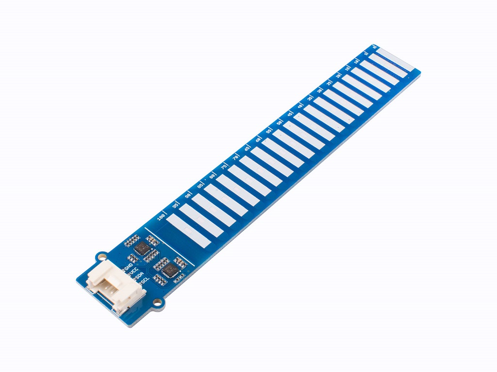

# Grove water level sensor support for ESPHome

This project integrates the
[Grove water level sensor](https://wiki.seeedstudio.com/Grove-Water-Level-Sensor/)
from Seeed Studio into ESPHome.



This sensor is a capacitance-based sensor with a conformal coating
that allows it to be submerged in water without deterioration common
to resistive sensors.

The sensor uses two I2C addresses (0x77 and 0x78) to probe a total of
twenty distinct capacitors across its surface (10 cm of length).

## How do I program my ESPHome device to use the sensor?

Use your own version of this sample ESPHome sketch:

```yaml
esphome:
  name: water-level
  friendly_name: Water level

external_components:
  - source:
      type: git
      url: https://github.com/Rudd-O/grove-water-level-sensor
      ref: master
    components:
    - grove_water_level

esp32:
  board: nodemcu-32s
  framework:
    type: esp-idf

# Enable logging
logger:
  level: debug

# Enable Home Assistant API
api:
  encryption:
    key: !secret api_key

ota:
  password: !secret ota_password

wifi:
  ssid: !secret wifi_ssid
  password: !secret wifi_password

i2c:
  sda: GPIO21
  scl: GPIO22
  scan: true
  id: bus_a

sensor:
- platform: grove_water_level
  water_level:
    # This indicates the water level by measuring capacitance bottom to top
    # and ignoring capacitance from capacitive cells above the water line,
    # which may read high capacitance due to water droplets.
    name: Water level
  moisture:
    # This indicates moisture by measuring capacitance across all capacitive
    # cells, summing each cell's 0-100% value and dividing by the number of cells.
    name: Moisture
```
